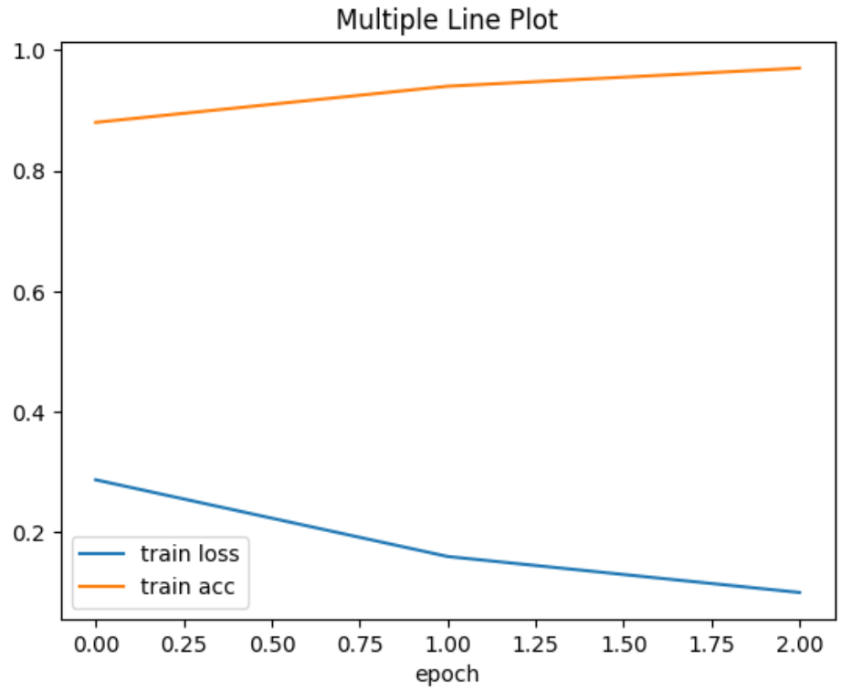

### 相关链接

- **Bag of Words  Meets Bags of Popcorn**: [Bag of Words Meets Bags of Popcorn | Kaggle](https://www.kaggle.com/c/word2vec-nlp-tutorial/overview/part-2-word-vectors)

### 各模型的训练结果
- **imdb_bert_native**
  
| Epoch | Train Loss | Train Acc | Val Loss | Val Acc |
|-------|------------|-----------|----------|---------|
| 0     | 0.2872     | 0.88      | 0.3236   | 0.86    |
| 1     | 0.1600     | 0.94      | 0.2055   | 0.92    |
| 2     | 0.1003     | 0.97      | 0.2910   | 0.90    |

- **imdb_roberta**
  
| Epoch | Train Loss | Train Acc | Val Loss | Val Acc |
|-------|------------|-----------|----------|---------|
| 0     | 0.3009     | 0.87      | 0.2062   | 0.92    |
| 1     | 0.1807     | 0.93      | 0.1991   | 0.93    |
| 2     | 0.1250     | 0.96      | 0.2127   | 0.92    |

- **imdb_deberta**

| Epoch | Train Loss | Train Acc | Val Loss | Val Acc |
|-------|------------|-----------|----------|---------|
| 0     | 0.1784     | 0.93      | 0.1304   | 0.95    |
| 1     | 0.1023     | 0.97      | 0.1361   | 0.95    |
| 2     | 0.0635     | 0.98      | 0.1630   | 0.95    |
- **imdb_deberta_lora**
  
| Epoch | Training Loss | Validation Loss | Accuracy  |
|-------|---------------|-----------------|-----------|
| 1     | 0.234300      | 0.236316        | 0.962250  |
| 2     | 0.131400      | 0.210252        | 0.964000  |
| 3     | 0.321800      | 0.209702        | 0.964750  |  
- **imdb_deberta_prompt**

| Epoch | Training Loss | Validation Loss | Accuracy |
|-------|---------------|-----------------|----------|
| 1     | 0.945800      | 0.739726        | 0.861200 |
| 2     | 0.639500      | 0.502881        | 0.910400 |
| 3     | 0.535400      | 0.488399        | 0.916800 |

