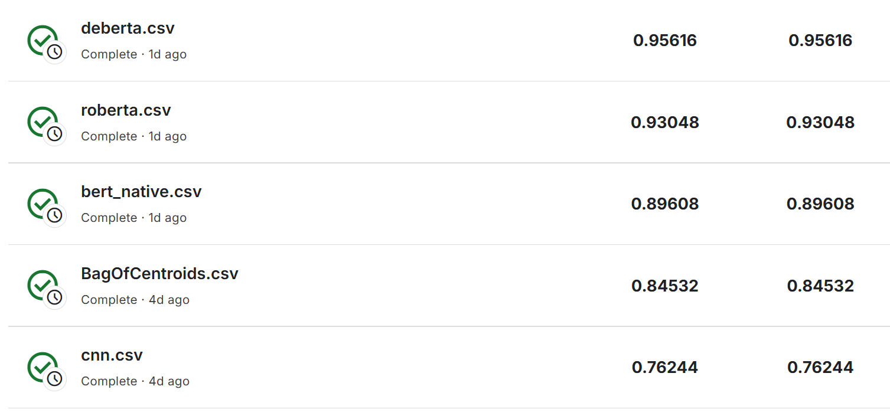

### 相关链接

- **Bag of Words  Meets Bags of Popcorn**: [Bag of Words Meets Bags of Popcorn | Kaggle](https://www.kaggle.com/c/word2vec-nlp-tutorial/overview/part-2-word-vectors)

### 各模型的训练结果
- **imdb_bert_native**
```
Epoch 0: train loss=0.2872, train acc=0.88, val loss=0.3236, val acc=0.86
Epoch 1: train loss=0.1600, train acc=0.94, val loss=0.2055, val acc=0.92
Epoch 2: train loss=0.1003, train acc=0.97, val loss=0.2910, val acc=0.90
```

- **imdb_roberta**
```
Epoch 0: train loss=0.3009, train acc=0.87, val loss=0.2062, val acc=0.92
Epoch 1: train loss=0.1807, train acc=0.93, val loss=0.1991, val acc=0.93
Epoch 2: train loss=0.1250, train acc=0.96, val loss=0.2127, val acc=0.92
```

- **imdb_deberta**
```
Epoch 0: train loss=0.1784, train acc=0.93, val loss=0.1304, val acc=0.95
Epoch 1: train loss=0.1023, train acc=0.97, val loss=0.1361, val acc=0.95
Epoch 2: train loss=0.0635, train acc=0.98, val loss=0.1630, val acc=0.95
```
在kaggle上的评分
